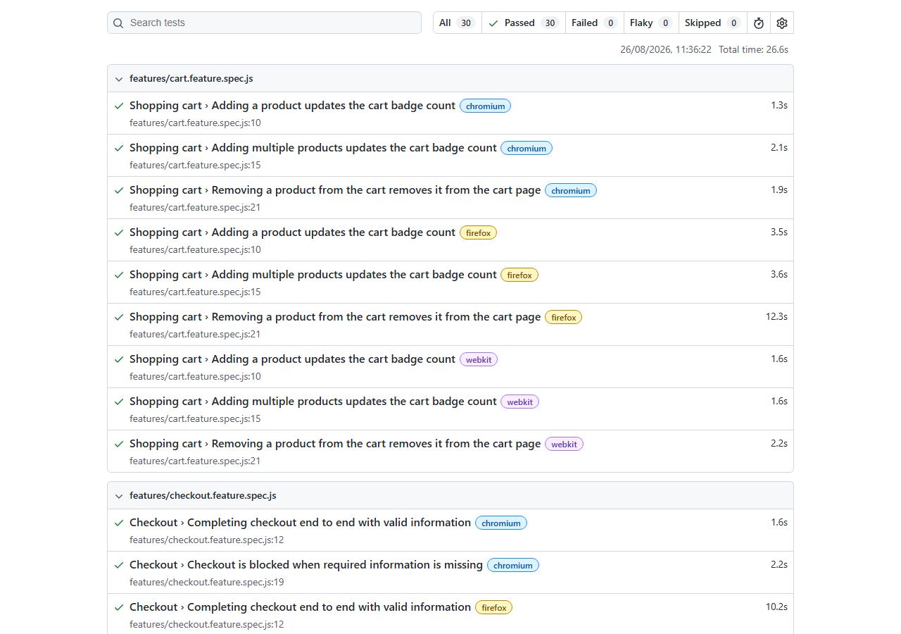

# SauceDemo Playwright BDD

End-to-end test suite for [SauceDemo](https://www.saucedemo.com) built with **Playwright**, **TypeScript**, and **Gherkin/Cucumber (BDD)**, following the **Page Object Model**.

This mirrors the practice used in my Cypress + Cucumber/BDD suite ([Desafio-Automacao-Inventario-CTI](https://github.com/WylkerReis/Desafio-Automacao-Inventario-CTI)) — same approach (Gherkin scenarios, POM, clean test architecture), applied to a different tool.



## Why this project

SauceDemo is a public e-commerce practice site with login, a product catalog, cart, and checkout — flows that map closely to what an automation suite looks like on a real project. The suite covers:

- **Login** — valid credentials, a locked-out account, and an invalid password.
- **Cart** — adding one or several products and removing a product, all verified against the cart badge/contents.
- **Sorting** — reordering the product catalog by price and by name.
- **Checkout** — a full end-to-end purchase, and a required-field validation error.

## Tech stack

- [Playwright](https://playwright.dev/) (`@playwright/test`) — browser automation and test runner
- [playwright-bdd](https://github.com/vitalets/playwright-bdd) + [`@cucumber/cucumber`](https://github.com/cucumber/cucumber-js) — compiles `.feature` files into native Playwright tests, so the suite keeps Playwright's fixtures, parallelization, and HTML reporting instead of a separate BDD runner
- TypeScript
- GitHub Actions for CI

## Project structure

```
features/     Gherkin scenarios (Given/When/Then), business language
steps/        Step definitions — call into page objects, hold no selectors
pages/        Page Object classes (LoginPage, InventoryPage, CartPage, CheckoutPage, BasePage)
```

Each `.feature` file describes one user-facing flow in plain language a non-technical stakeholder could follow. Step definitions translate those steps into Playwright actions by delegating to the page objects — selectors live only in `pages/`.

```gherkin
Scenario: Successful login with valid credentials
  Given I am on the login page
  When I log in with username "standard_user" and password "secret_sauce"
  Then I should see the inventory page
```

## Running the tests

```bash
npm install
npx playwright install
npm test
```

`npm test` runs `bddgen` (compiles the feature files into runnable Playwright specs under `.features-gen/`) followed by `playwright test`, across Chromium, Firefox, and WebKit.

Other useful commands:

```bash
npm run test:headed   # run with visible browser windows
npm run report         # open the last HTML report
```

## Continuous Integration

Every push and pull request runs the full suite via [GitHub Actions](.github/workflows/playwright.yml), which installs dependencies and browsers, generates the tests from the feature files, and runs them headless. The HTML report is uploaded as a workflow artifact.

[](https://github.com/WylkerReis/SauceDemo-Playwright-BDD/actions/workflows/playwright.yml)

## Author

**Wylker Reis** — QA Automation Engineer
[GitHub](https://github.com/WylkerReis)
